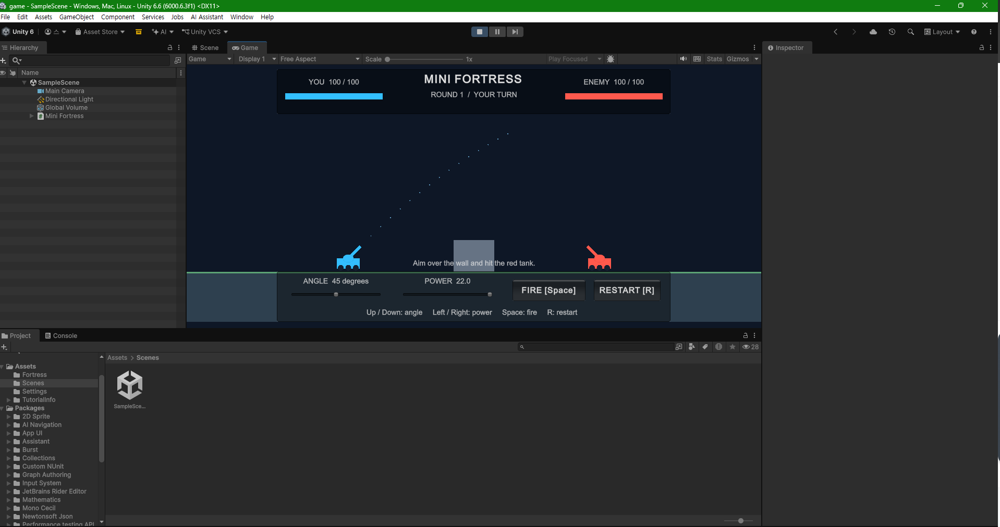
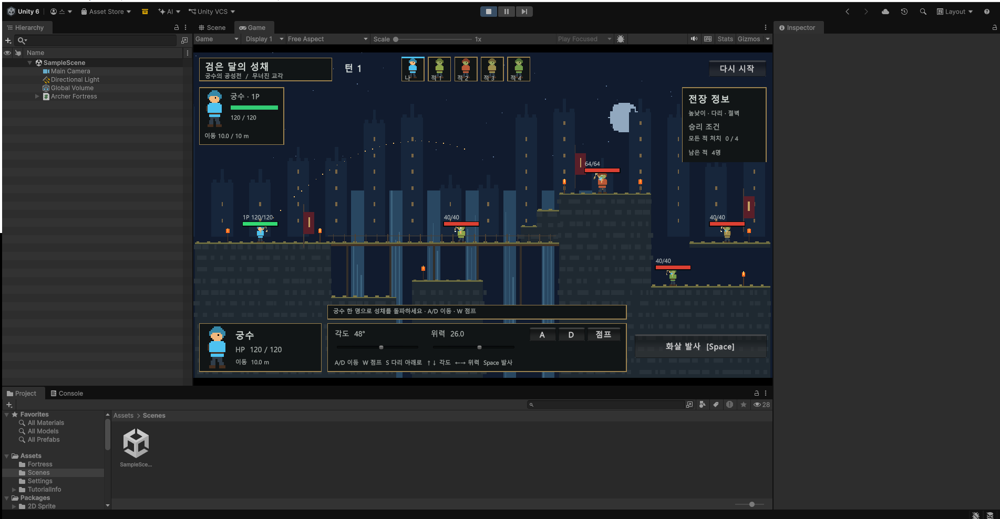

# 효건 아이디어 노트

- [포트리스 설명](/game/FORTRESS_README.md)

게임 개발 아이디어 v1

1. 기본 게임 방향

- 포트리스의 전투 방식과 카드게임 장르를 결합
- 포트리스 요소는 복잡하지 않게 각도 조절 정도로 활용
- 초기에는 싱글플레이 게임으로 개발
- 추후 최대 4인 협동 플레이 지원
- 각 플레이어가 자신의 턴에 행동
  - 공격
  - 이동
- 맵에서 직접 이동해야 하기 때문에 맵은 어느 정도 규모가 있도록 구성

2. 직업 시스템

직업은 총 6개 정도로 구성.

직업 예시

- 연금술사
- 마법사
- 활병
- 포병
- 창방패병
- 타워전문가(메카닉)
- 광신도
  - 특성 선택 불가

3. 특성 시스템

직업과 특성을 조합하여 게임을 진행.

특성은 처음부터 선택하는 것이 아니라 게임을 진행하다가 해당 특성방에 도착했을 때 선택.

특성에 따라 사용하는 카드와 장비가 변경됨.

특성 예시

- 전통
  - 전통 연금술사
  - 전통 마법사 등
- 부패
- 불
  - 강해질 경우 용암으로 발전
- 물
- 흑
- 번개
- 용
- 얼음
- 블러드
- 자연
  - 페어리
- 대지
- 독
- 폭풍

추후 특성과 관련된 이스터에그 요소도 추가.

4. 직업 × 특성 조합

직업과 특성을 조합하여 각 캐릭터의 카드와 장비가 변경되는 구조.

예시

- 연금술사 + 전통
- 마법사 + 전통
- 활병 + 불
- 포병 + 번개
- 창방패병 + 얼음

특성에 따라 같은 직업이라도 사용하는 카드와 장비가 달라질 수 있음.

5. 크툴루 신화 / 고대신 시스템

게임 시작 전에 크툴루 신화 기반의 고대신 3마리 중 1마리를 선택.

선택한 고대신과 관련된 카드를 게임 중 사용할 수 있음.

관련 카드 예시

- 고대신을 일깨우는 카드
- 고대신 강화 카드

예를 들어 고대신이 기본적으로 30턴 후 깨어나는 구조라면, 고대신을 일찍 일깨우는 카드를 사용하여 등장 시기를 앞당길 수 있음.

고대신이 깨어나면 맵 뒤의 배경이 해당 고대신의 배경으로 변경됨.

고대신을 깨웠을 때는 각 고대신에 맞는 효과를 획득하거나 해당 존재를 소환.

6. 게임 진행 및 방 선택

게임을 진행할 때 다음에 이동할 방이 랜덤하게 2~3개의 선택지로 등장.

플레이어는 그중 하나를 선택하여 진행.

멀티플레이에서는 투표를 통해 다음 방을 결정.

예시

- 4인 플레이에서 3:1 → 3명이 선택한 방으로 이동
- 2:2 → 랜덤으로 결정

7. 방 종류

게임 내 방은 여러 종류로 구성.

- 일반 몬스터 방
- 강화 방
- 박스 방
- 보스 방
- 중간 보스 방
- 선택방
  - 선택지에 따라 추후 강해지거나 약해질 수 있음
- 패시브 유물 선택방
- 체력 회복방
- 특성방
  - 해당 방에서 특성 선택

8. 맵 구조

캐릭터가 실제로 이동하면서 전투하는 구조이기 때문에 맵은 어느 정도 규모가 있도록 구성.

방을 선택한 뒤 해당 맵에서 이동과 전투를 진행.

전투에서는 포트리스처럼 각도를 조절하여 공격하는 요소를 활용.

플레이어의 턴마다 공격 또는 이동을 진행.

9. 멀티플레이

추후 최대 4인 협동 플레이 지원.

각 플레이어가 자신의 턴을 가지고 순서대로 진행.

자신의 턴에서는

- 이동
- 공격

등의 행동을 진행.

방 선택은 플레이어들의 투표로 결정하며 2:2 동률일 경우 랜덤으로 결정.

10. 추가 성장 요소 / 2차 전직

게임이 성공했을 경우 추후 확장 요소로 2차 전직 시스템 추가.

직업별 2차 전직 예시

- 활병
  
  - 석궁
  - 총

- 창방패병
  
  - 올라프 같은 도끼맨
  - 창 강화

- 연금술사
  
  - 연금술 강화
  - 과학자

기존 직업에서 서로 다른 방향으로 성장할 수 있도록 구성.